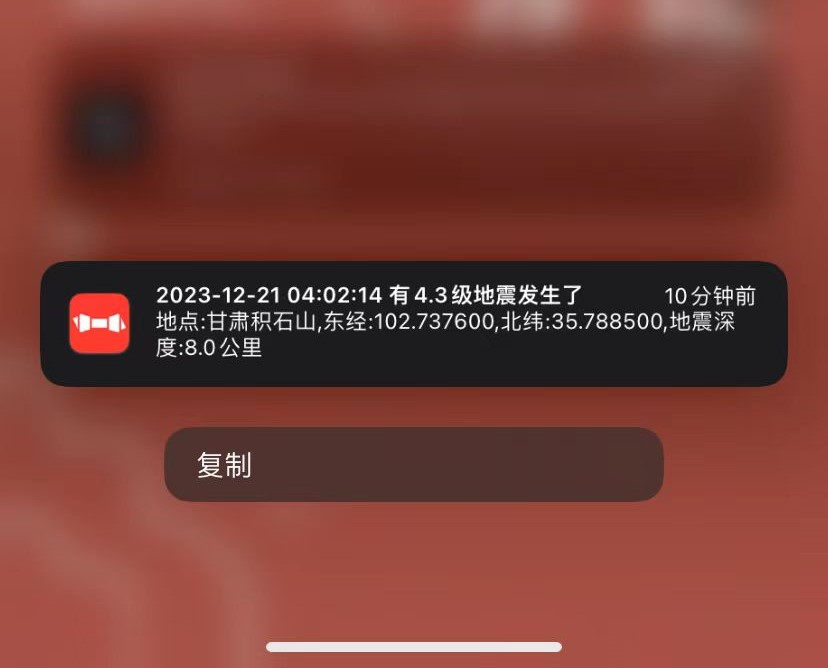

# Earthquake Alert 

## Getting Started
### Build Container
```shell
make container
```

### Run

```shell
docker run -d --restart=always earthquake-alert:<image-version> --key=<your bark key> --duration=3s
```
### Notification Screenshot

